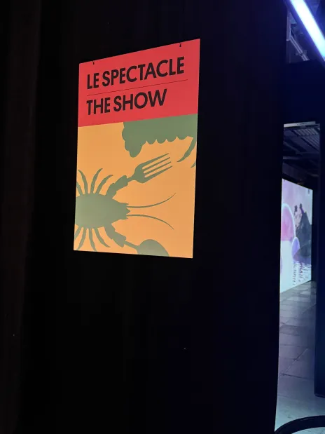
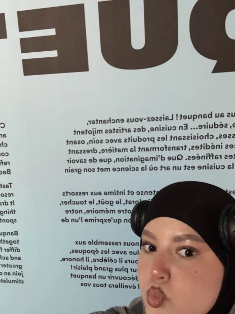
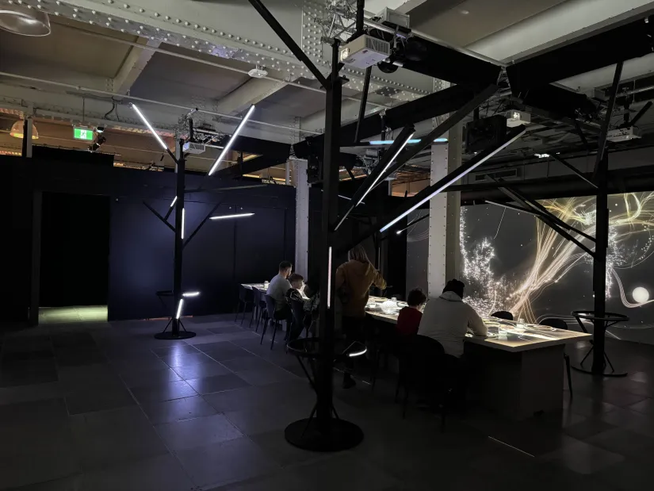
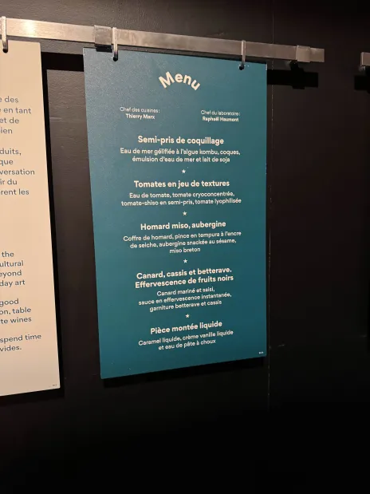
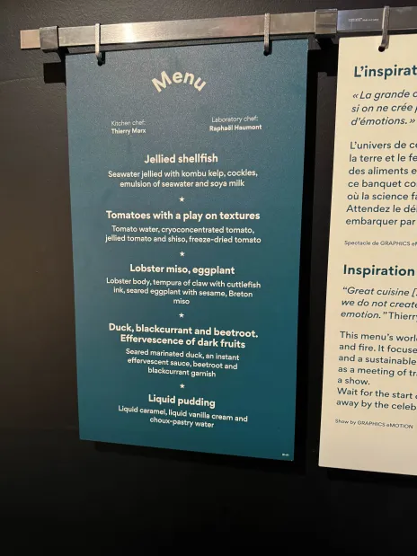
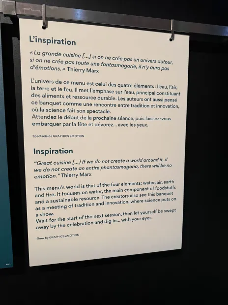

# TRAVAIL 1: VISITE ET EXPÉRIENCE D'UNE EXPOSITION AU CENTRE DES SCIENCES DE MONTRÉAL
## (Répertoire GitHub) 15% (REMISE semaine 5)

### NOM DE L'EXPOSITION OU DE L'ÉVÉNEMENT
#### LE SPECTACLE 

### LIEU DE MISE EN EXPOSITION

#### MA GROSSE TÊTE

### TYPE D'EXPOSITION (TEMPORAIRE, PERMANANTE, ITINÉRANTE, INTÉRIEURE, EXTÉRIEURE)
#### PERMANANTE

### DATE DE VOTRE VISITE
#### 30 JANVIER 2025

### TITRE DU DISPOSITIF CHOISI (vue d'ensemble du dispositif)

### NOM DE LA FIRME (texte de présentation ou explicatif)
  
### ANNÉE DE RÉALISATION
####2021

### DESCRIPTION DE L'OEUVRE (texte + diverses vues)

### TYPE D'INSTALLATION (COMTEMPLATIVE, IMMERSIVE, INTERACTIVE) (description+photo)

### MISE EN ESPACE (vue d'ensemble de la piece + faire un croquis de la mise en page)

### COMPOSANTES ET TECHNIQUES (chacune des parties composantes du dispositif)

### ÉLÉMENTS NÉCESSAIRES À LA MISE EN EXPOSITION (chacun des elements que le musée a mis en place pour que le dispositif soit présenté (bancs, cache-fil, crochets, sac de sable, cables, eclairage, herses, rideaux ou cloisons)

### EXPÉRIENCE VÉCUE (posture du visiteur ou gestes de l'interacteur, possibilité d'intégrer de courts vidéos pour documenter l'interactivité avec celle-ci)

### CE QUI VOUS A PLU, VOUS A DONNÉ DES IDÉES ET POURQUOIS (justifications, éléments pertinents) 

