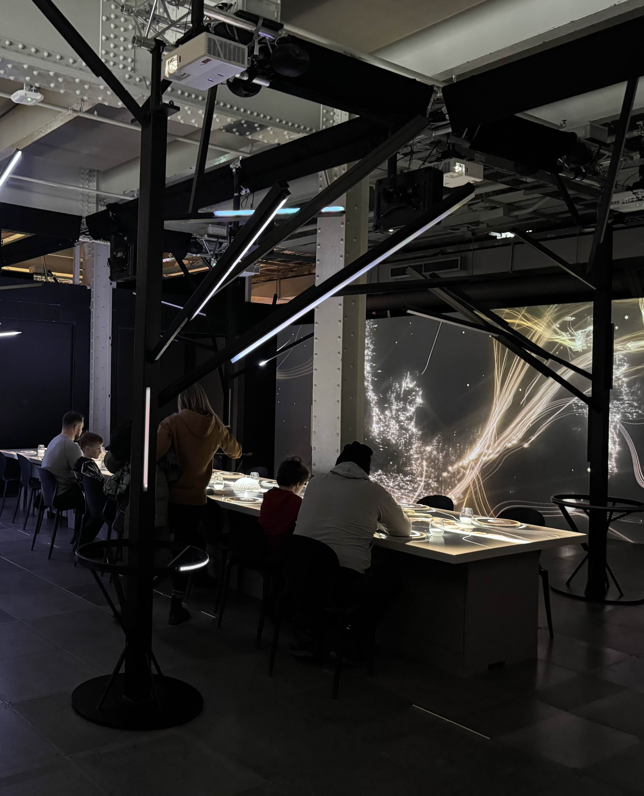
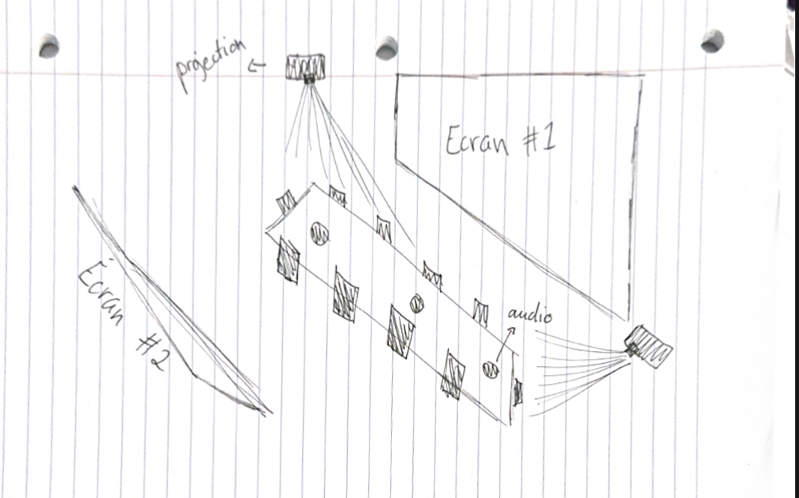
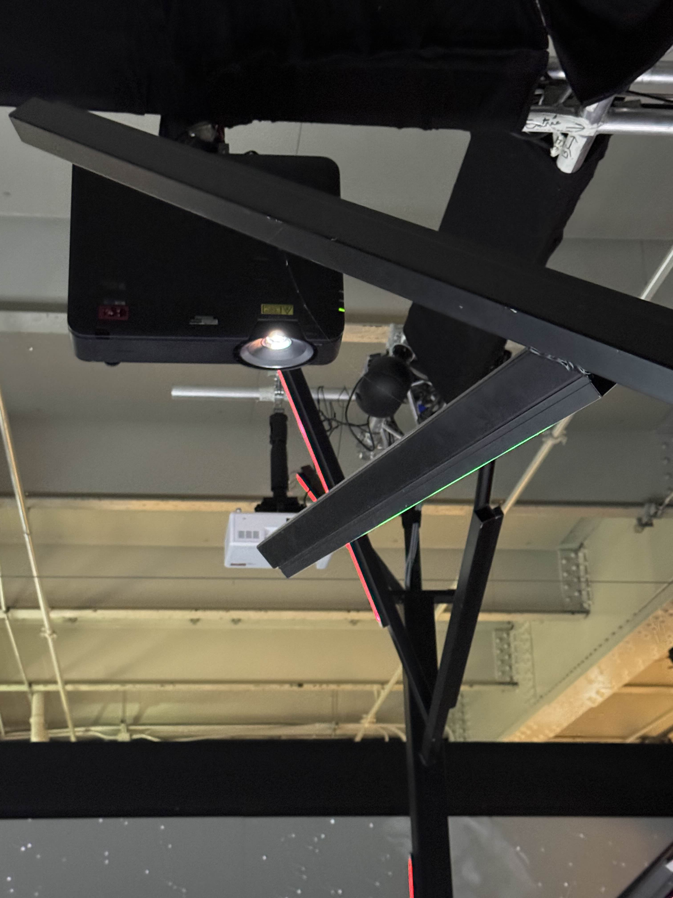

# TRAVAIL 1: VISITE ET EXPÉRIENCE D'UNE EXPOSITION AU CENTRE DES SCIENCES DE MONTRÉAL

****

### Le Spectacle – Une immersion artistique permanente

****

  

#### Depuis 2021, Le Spectacle est une exposition permanente qui invite les visiteurs à un voyage immersif à travers l’art et l’émotion. Présentée dans un espace intérieur soigneusement conçu, cette exposition célèbre la fusion des formes, des couleurs et des sons pour éveiller les sens et l’imaginaire.

#### Lors de ma visite le 30 janvier 2025, j'ai pu découvrire toute la richesse et la profondeur de cette œuvre intemporelle. Chaque passage dans Le Spectacle est une nouvelle expérience, révélant les multiples facettes d’une créativité qui repousse sans cesse les limites artistiques.

#### Un rendez-vous incontournable pour tous les amateurs d’art contemporain, où l’émotion est au cœur de la découverte.
****

     

#### Le Spectacle est une exposition multimédia immersive où les visiteurs s'installent autour d'une table centrale pour un voyage sensoriel inédit. Chaque plat et chaque instant deviennent une œuvre d’art éveillant la vue, l’ouïe, l’odorat, le goût et le toucher. Au-delà d’un simple repas, cette expérience est une fusion totale des sens. Elle respecte églament un menu spécifique et une inspiration, avec image à l'appui !

  

####  Voici également un croquis de l'exposition, afin que vous puissez mieux comprendre l'environnement.

### Les Coulisses Techniques "Le Spectacle" 
#### L’exposition combine plusieurs technologies immersives pour éveiller les sens autour d'une table centrale. Des projecteurs diffusent des images et des animations sur la table et les murs, transformant chaque plat en œuvre visuelle. Un système audio disposé sur les tables enveloppe les invités, synchronisant sons et expérience visuelle pour une immersion totale. Un son de fond calme, créant une ambiance apaisante, accompagne chaque moment, renforçant l’atmosphère immersive de l’exposition.

#### Des diffuseurs d’arômes libèrent des parfums en fonction des plats, enrichissant l’expérience sensorielle. Chaque senteur, soigneusement sélectionnée, complète les saveurs et peut évoquer des souvenirs ou des émotions spécifiques. Cette harmonie entre les parfums et les mets transforme chaque dégustation visuelle en un moment unique et immersif!

  

### ÉLÉMENTS NÉCESSAIRES À LA MISE EN EXPOSITION (chacun des elements que le musée a mis en place pour que le dispositif soit présenté (bancs, cache-fil, crochets, sac de sable, cables, eclairage, herses, rideaux ou cloisons)

### EXPÉRIENCE VÉCUE (posture du visiteur ou gestes de l'interacteur, possibilité d'intégrer de courts vidéos pour documenter l'interactivité avec celle-ci)

### CE QUI VOUS A PLU, VOUS A DONNÉ DES IDÉES ET POURQUOIS (justifications, éléments pertinents) 

