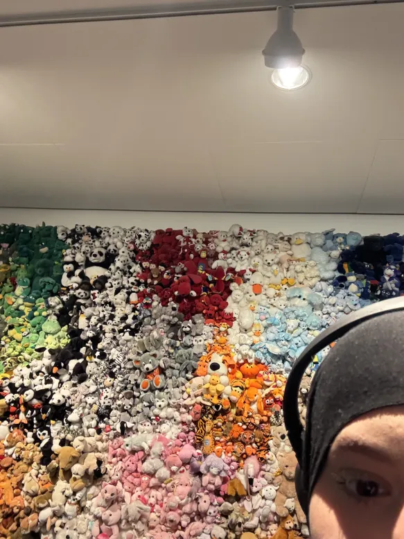
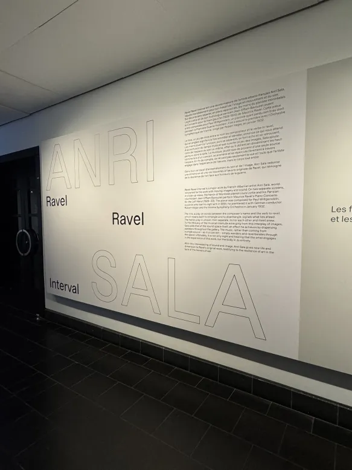
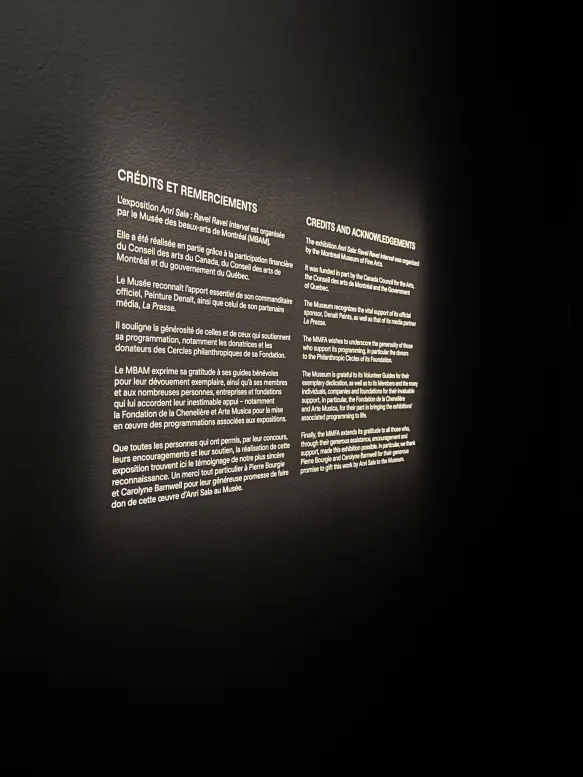
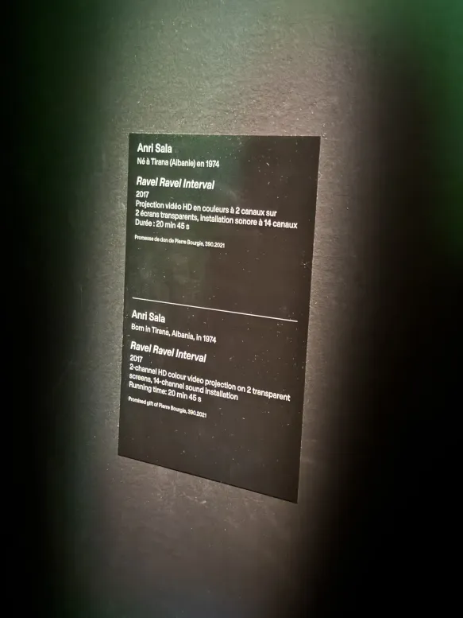
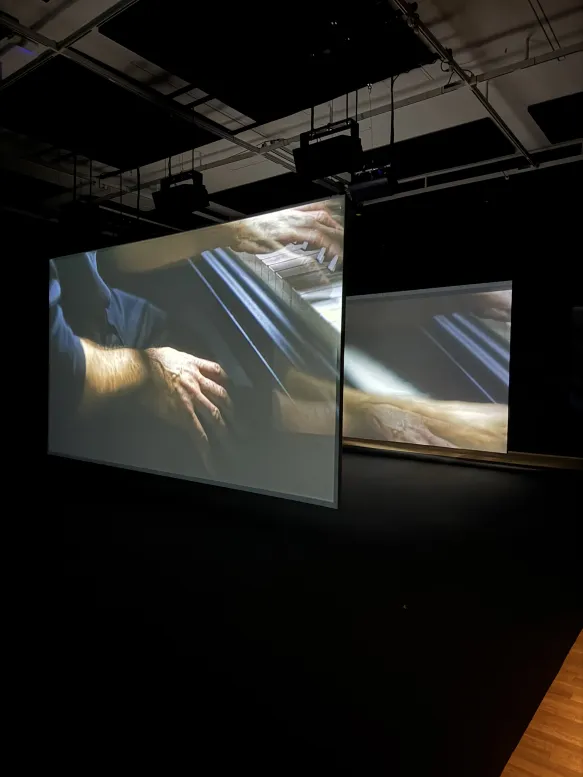
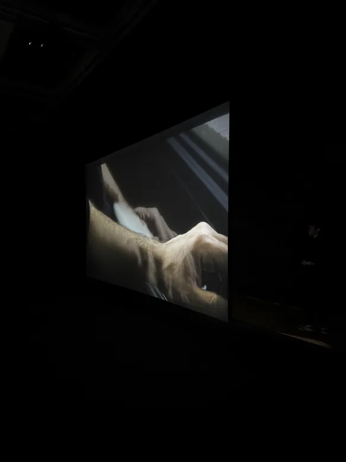
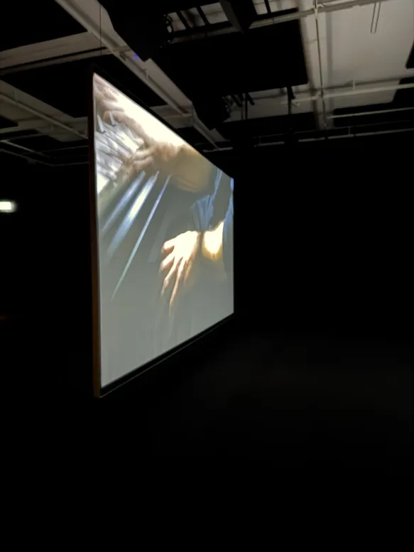
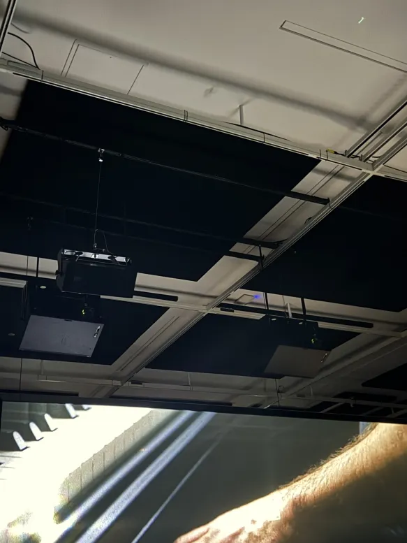
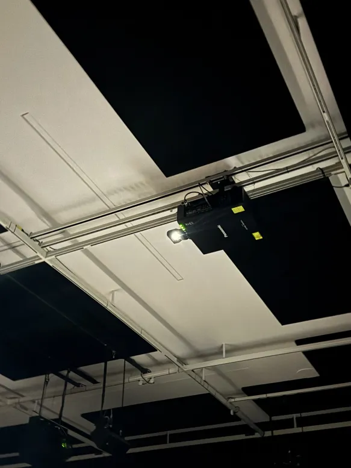

# TRAVAIL 5: VISITE ET EXPÉRIENCE D'UNE EXPOSITION AU MUSÉE DES BEAUX ARTS À MONTRÉAL

****

  

*Moi, au Musée des beaux-arts de Montréal.*

***
## Ravel Ravel Interval 

   

#### Le MBAM présente pour la première fois au Canada, dans son espace du Carré d’art contemporain, une installation vidéo immersive de l’artiste franco-albanais Anri Sala, reconnu à l’international. L’œuvre, intitulée Ravel Ravel Interval (2017), une exposition permanante, est une version revisitée de Ravel Ravel (2013), que l’artiste avait présentée à la 55e Biennale de Venise, alors qu’il représentait la France.

***

     

***

### Ravel Ravel Interval : La Déroulement

#### L’installation montre deux vidéos projetées en même temps, où deux pianistes jouent le Concerto pour la main gauche de Ravel. Leurs interprétations, enregistrées séparément, sont légèrement décalées, créant un effet d’écho et de décalage. Le son est spatialisé, ce qui plonge le spectateur dans une expérience immersive, où il perçoit les variations de rythme et d’intensité comme s’il était au centre de la musique. L’œuvre explore autant la musique que notre perception du temps, de l’écoute et de la répétition.

##### *Voici une vidéo qui présente bien l'oeuvre: https://youtube.com/shorts/4jYAy05xEdI*

*** 

####  *Voici également un croquis de l'exposition, afin que vous puissez mieux comprendre l'environnement.*
***

### Ravel Ravel Interval : Les Coulisses Techniques

#### Pour Ravel Ravel Interval, Anri Sala utilise deux projecteurs vidéo qui diffusent simultanément les images de deux pianistes. Chaque projecteur envoie l’image sur un écran distinct, créant un face-à-face visuel entre les deux interprétations. Le son, diffusé de façon spatialisée, accentue les décalages subtils entre les versions. Ce dispositif d’images synchronisées et de sons décalés plonge le spectateur dans une expérience immersive, centrée sur la perception du temps, du rythme et de l’écoute.
***

 

***
### Ravel Ravel Interval : Conclusion 
***

#### Ravel Ravel Interval m’a laissé une impression partagée. D’un côté, j’ai trouvé l’œuvre assez longue et parfois ennuyante, surtout parce qu’elle demande beaucoup de concentration et de patience. Le rythme lent et répétitif peut devenir monotone, surtout si on n’est pas habitué à ce type d’installation. Cependant, la superposition des deux écrans projetant les vidéos des pianistes crée une dynamique intéressante et profonde. Ce jeu de déphasage, renforcé par le son spatialement diffusé, crée une sensation de superposition des temps et des espaces, qui fait réfléchir sur la perception du temps, de la musique et de la répétition. Même si ce n’est pas une œuvre facile à suivre, elle reste profondément immersive et propose une expérience sensorielle unique, qui questionne l’écoute et la manière dont on perçoit la réalité sonore. C’est une œuvre qui, bien que difficile à apprécier pleinement au premier abord, laisse une impression durable et invite à la réflexion.
