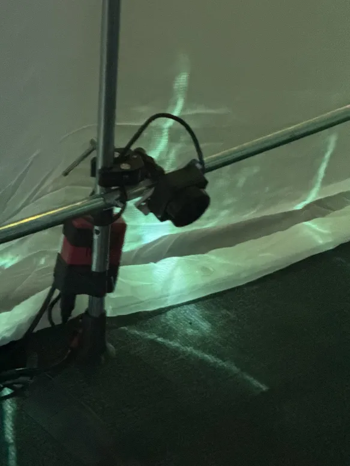

# TRAVAIL 2: MON PROJET PRÉFÉRÉ
****
## Internature

 

#### Cet exposition à été crée par Kenza El Harrif, Isaac Fafard, Delphine Grenier, Khaly Tia Sing et Sitmonternna Yi en session d'hiver 2025 durant leur projet de finissant de la technique d'intégration multimédia. Lors de ma visite le 27 février et le 18 mars, j'ai pu découvrir leur exposition nommée Internature, qui est un tunnel immersif qui utilise le mapping vidéo interactif sur ses parois. Au centre de cet espace, l'utilisateur manipule une boule, déclenchant un jeu de lumière dynamique tout en l'invitant à réfléchir sur l'impact humain sur la nature.

#### L'installation est du genre intéractive et immersive. À l'entrée, une sphère illuminée, posée sur un piédestal au centre du tunnel, réagit à votre présence. En vous approchant, le son devient plus intense. En tournant la sphère, des projections de vignes grimpantes se développent sur les parois du tunnel, suivant vos mouvements. Lorsque les parois sont couvertes de vignes et de fleurs en bouton, la lumière autour de la sphère s'éteint. Les parois deviennent interactives, invitant les utilisateurs à toucher les fleurs et disperser les pétales dans l'espace. Lorsque le mouvement cesse, les vignes se rétractent et le son s'estompe.

****

## Internature : Les Coulisses Techniques 

  

#### L'exposition utilise plusieurs technologies pour créer une expérience immersive et interactive. À l'extérieur, deux projecteurs, placés de chaque côté de la pièce, projettent des images de fleurs en mouvement sur la paroi du tunnel. À l'intérieur, des dispositifs audio plongent les visiteurs dans une ambiance sonore immersive. Au centre, la sphère interactive réagit aux mouvements des participants, déclenchant des effets visuels et sonores en temps réel, permettant une interaction fluide avec l'environnement.

****

## Internature : Croquis

#### Afin que ce soit plus clair, voici un croquis de l'exposition. 
 
****

## Internature : Conclusion

****

J'ai visité l'exposition Internature et j'ai été vraiment impressionné. Dès l'entrée, les parois du tunnel réagissent aux mouvements des visiteurs, projetant des vignes et des fleurs qui se développent sur les murs. C’est fascinant de voir l’espace changer en temps réel. L’aspect interactif est captivant : en touchant la balles rapidement, on déclenche des effets de lumière et de son qui crée une athmosphère incroyablement apaisante. L'ambiance, de son côté, va alimenter cet athmosphère et l'imersesion. L'utilisation des technologies est brillante et l'expérience est fluide. Ce que j'ai aimé le plus, c'est que les utilisateurs étaient invités à être littéralement à l'intérieur de l'exposition en elle-même. C’est une exposition originale qui mêle art et technologie de manière intelligente!

##### *Source: https://www.youtube.com/watch?v=pLxNPbXbVRE, https://tprangers.github.io/internature/#/*
