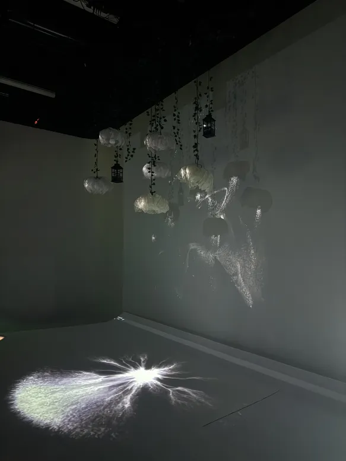
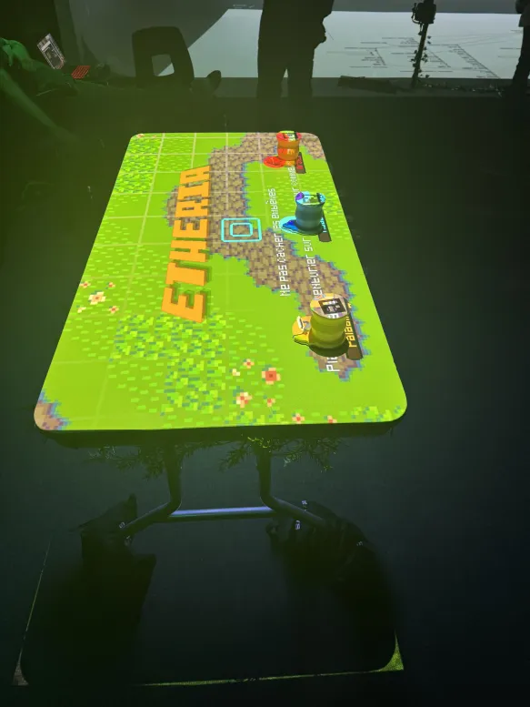

# TRAVAIL 2: AUTRES PROJETS
****

## Première position: 
### Luminatura
****

#### Luminatura est une installation interactive qui fusionne nature et technologie, explorant la communication entre l'humain et l'environnement à travers la capacitance. Elle à été crée par Audrey Dandurand, Camilia Bouatmani, Ihab Mouhajer, Justine Rousseau et Prethiah Rajaratnam, les élèves finissants de la technique d'intégration multimédia. 

#### Inspirée par "Forest of Resonating Lamps One Stroke" et "Pulse Room" de Rafael Lozano-Hemmer, l'œuvre crée une atmosphère magique avec des lanternes et des fleurs lumineuses suspendues, réagissant au toucher des utilisateurs. En touchant l'une des plaques métalliques, l'utilisateur active des capteurs de capacitance, déclenchant des lumières et sons en réponse. L'interaction entre plusieurs utilisateurs génère des variations sonores et lumineuses, renforçant l'expérience immersive. Les ambiances sonores naturelles, telles que les bruits de forêt et d'eau, accentuent la connexion avec la nature.
****

### Luminatura : Plantation
****

 

##### *Afin qu'on comprenne plus en profondeur l'installation de l'oeuvre, voici les plantations realisés par l'équipe.*
****

### Luminatura : Vécu sensoriel

#### L'exposition Luminatura m'a vraiment impressionné. Dès que j'ai posé mes mains sur les plaques métalliques, j'ai senti comme une connexion avec l'installation, comme si mes gestes faisaient réagir l'espace autour de moi. Les lumières et les sons changeaient à chaque mouvement, ce qui rendait l'expérience encore plus immersive. Les bruits de la forêt et de l'eau ajoutaient une atmosphère calme et naturelle, et quand d'autres personnes sont venues, l'ambiance a évolué, rendant tout plus dynamique. Luminatura m'a permis de me sentir vraiment connecté à l'environnement, d'une manière différente et plus poétique.
****

### Luminatura : Les Coulisses

#### À propos des trois cours que je pense être indispensable afin de réaliser ce projet serait définitivement tous les cours de Web et tout ce qui à rapport avec le codage. Ensuite, ce serait les cours d'audio et finalement, je pense que le cours de la réalité mixte à été utile également. 

#### Concernant la technologie que je ne connaissais pas avant de voir l'exposition, il y en a pas vraiment. Si il y en a un que je maîtrise le moins, ce serait le JavaScript. Sinon, en voyant la grille de cours de la technique, je dirais les technologies de la réalité mixte serait le plus flou à mes yeux. 
****

##### *Source: https://ethereal-creators.github.io/Etheria/#/, https://www.youtube.com/watch?v=nwJlMtzI-8g*

## Deuxième position: 
### Etheria
****

#### Etheria est une installation interactive crée par Joshua Gonzalez-Berrera, Victor Gileau, Michael Un Dupré, Pierre-Luc Proulx et Maik Hamel, des finissants de la technique intégration multimédia. Etheria est un jeu en pixel art où les joueurs défendent la pierre d'Étheria contre des vagues d'ennemis. Chaque joueur place des figures pour protéger le cristal et peut les repositionner durant le jeu. À chaque manche, la difficulté augmente et des power-ups apparaissent. L'objectif est de collaborer pour éliminer les ennemis et empêcher la destruction du cristal. Des indicateurs donnent des infos clés sur la direction des ennemis et l'état du jeu.

### Etheria : Plantation
****

 

##### *Afin qu'on comprenne plus en profondeur l'installation de l'oeuvre, voici les plantations realisés par l'équipe.*

### Etheria : Vécu Sensoriel
****

#### L'exposition de Etheria m'a vraiment marqué. Le concept du jeu est super original et l'ambiance en art pixel est très intéressante. Ce qui m'a plu, c'est la coopération entre les joueurs, qui rend l'expérience plus amusante et excitante. La difficulté augmente au fur et à mesure des vagues d'ennemis, et les pouvoirs qui apparaissent nous forcent à changer constamment notre stratégie. Ça rend chaque partie captivante et pleine de surprises. En gros, l'exposition montre un jeu très agréable, avec un bon mélange de stratégie et d'action, qui plairait sûrement à ceux qui aiment jouer en groupe.

### Etheria : Les Coulisses
****

#### Pour réaliser ce projet, les cours essentiels seraient ceux sur le développement web et la programmation, car le jeu nécessite une bonne maîtrise du codage. Les d'illustration sont aussi importants pour créer les dessins graphiques. Enfin, le cours de réalité mixte est utile pour intégrer des éléments interactifs.

#### Concernant les technologies, je ne découvre pas vraiment de nouvelles choses, mais je maîtrise moins JavaScript encore une fois, souvent utilisé pour les interactions dynamiques. Les technologies de réalité mixte me semblent encore floues.

##### *Source: https://ethereal-creators.github.io/Etheria/#/10_equipe/, https://www.youtube.com/watch?v=nwJlMtzI-8g*

## Troisième position: 
### Fuga
****

#### Fuga est un projet générateur d'arbre qui va être personnalisé au son qui va être crée par l'interacteur. L'idée derrière ce projet est un groupe de scientifiques qui pour sauver la planète de l'industrialisation et de la mort de la vie vont crée une plante qui sera très sensible au fréquences, sons et vibrations. Le projet montre donc qu'il y a une balance a trouver entre la nature et la technologie. Chaque utilisateur va expérimenter des sons différents avec les outils qu'il y aura à disposition. Chaque arbre généré sera unique et va avoir des couleurs et des formes différentes. L'interacteur va devoir toucher plusieurs bouton du synthétiseur afin de générer ces mêmes arbres. Il y aura au dessus les écrans qui vont montrer la progressions des arbres qui vont venir en vie chacune de manière différentes.

### Fuga : Plantation
****

### Fuga : Vécu sensoriel
****

### Fuga : Les Coulisses
****

1. Titre des projets et créateurs

2. Photo des installation en cours (ou finale) dans les studios

3. Schéma de l'installation prévue (trouvé dans leur sites web)

4. Ressenti pendant l’expérimentation

5. 3 cours incontournables que nous pensons qui les ont aidés pour faire leur projets

6. Technique ou composante technologique que nous connaissions pas avant de voir les expos (js pour ma part)
