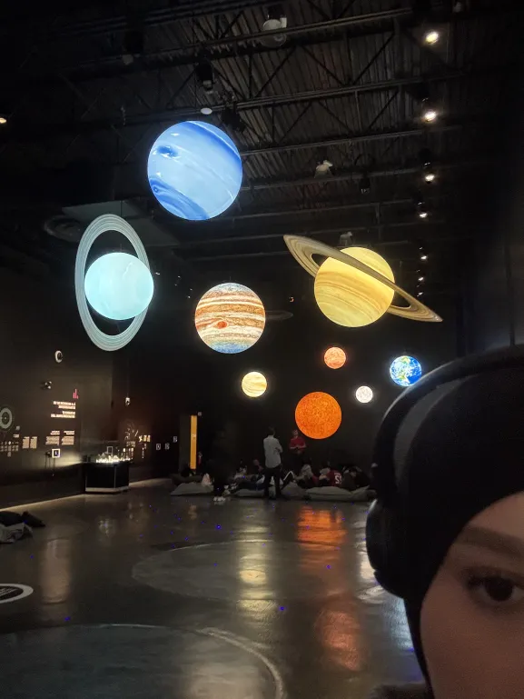
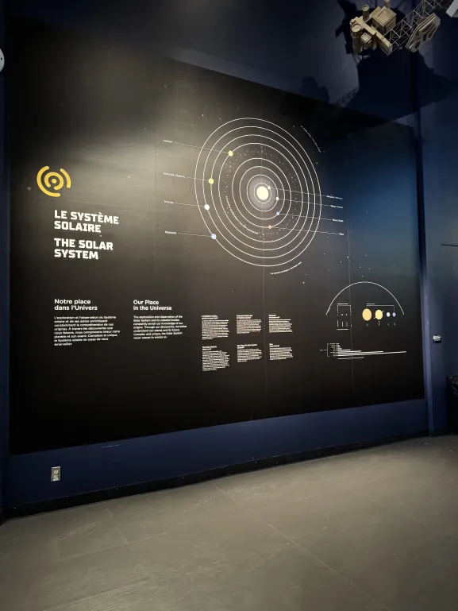
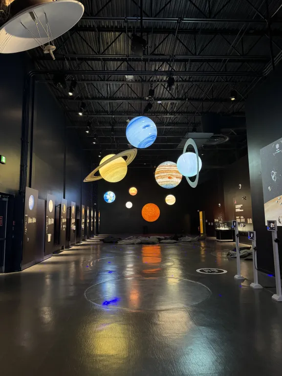
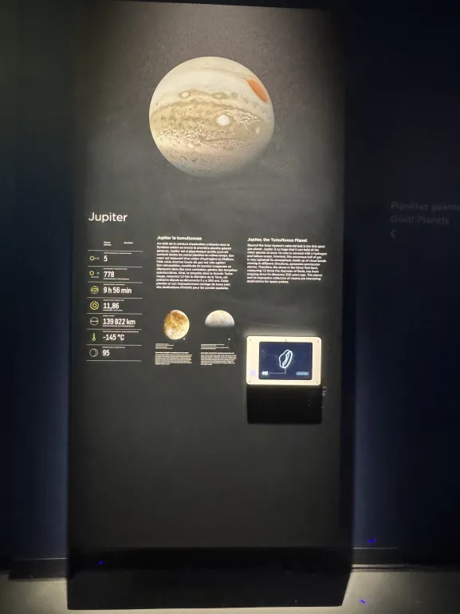
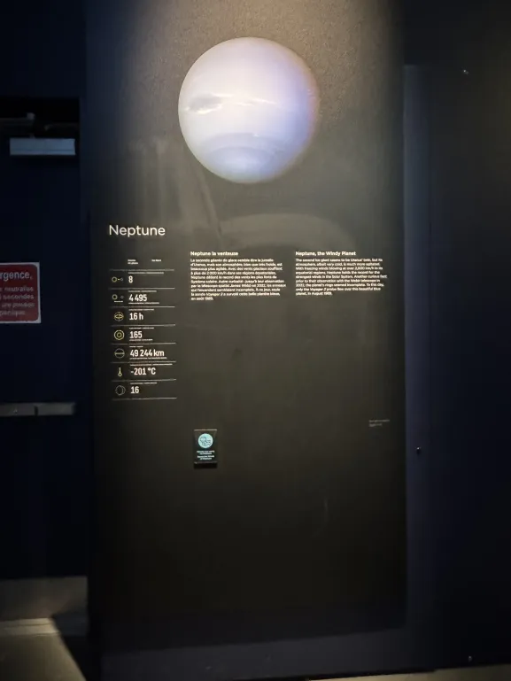
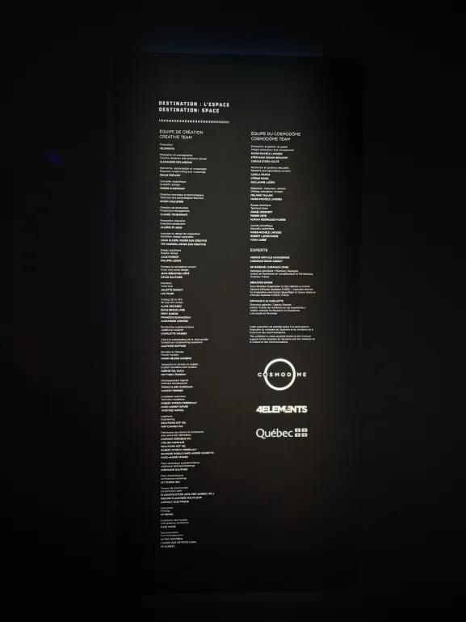
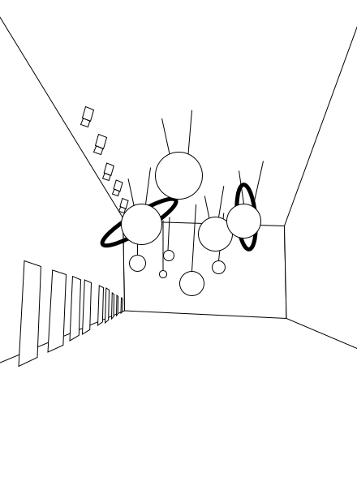
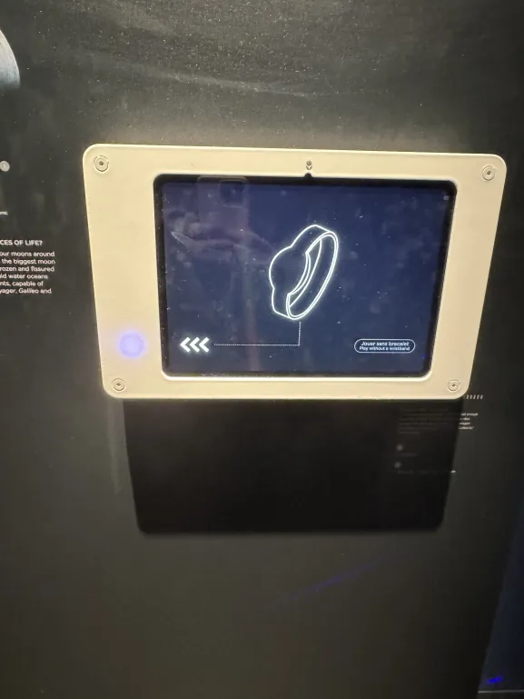
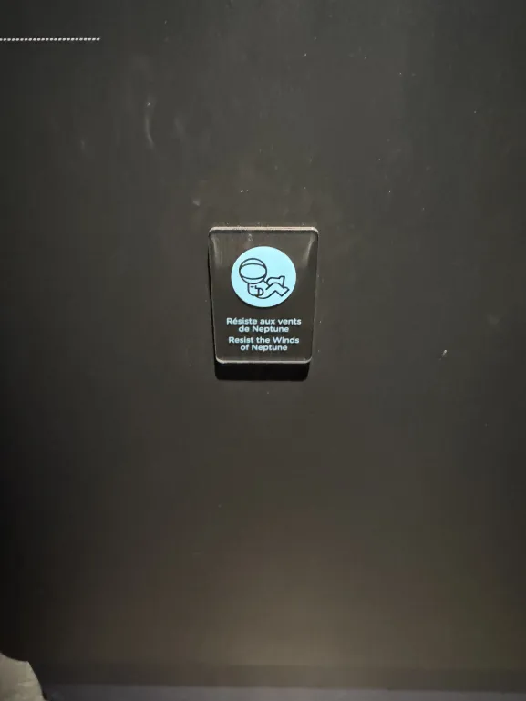
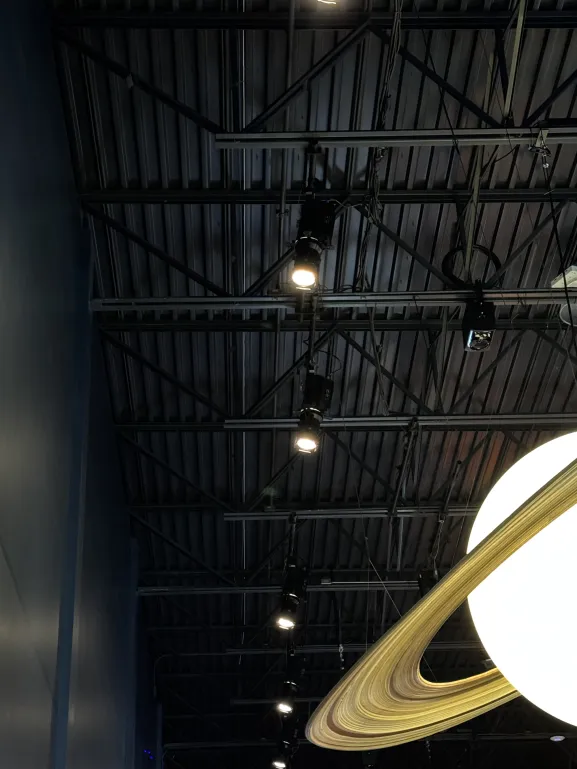

# TRAVAIL 3: VISITE ET EXPÉRIENCE D'UNE EXPOSITION INDIVIDUELLE AU COSMODÔME, LE SYSTÈME SOLAIRE

****

  

*Moi, devant l'oeuvre du système solaire au Cosmodôme.*

***
## Le Système Solaire 

     

##### *Photos prise par moi de l'exposition*

#### Le 11 mars 2025, j’ai eu l’occasion de découvrir une œuvre permanente fascinante consacrée au système solaire, inaugurée récemment en 2024. Cette installation artistique impressionnante comprend une représentation du système solaire suspendue au-dessus de nos têtes, ainsi que de petits stands dédiés à chaque planète. Chaque stand met en lumière une caractéristique unique de la planète qu’il représente. Par exemple, celui consacré à Uranus permet aux visiteurs d’interagir directement avec l’œuvre : en posant la main sur une plaque spéciale, on peut ressentir la froideur extrême associée à cette planète glacée.
 
***

### Le Système Solaire : La Déroulement

#### L’exposition se tient dans une salle sombre et immersive, où les planètes du système solaire sont suspendues au plafond, créant l’illusion de flotter dans l’espace. Chaque planète, illuminée et détaillée, attire le regard.Les visiteurs parcourent les stands alignés le long des murs, chacun offrant des informations ou des interactions liées à une planète. L’ambiance mêle lumières tamisées, sons et textures, offrant une expérience à la fois éducative et sensorielle, entre science et art.

  
##### *Voici également les crédits du dispositif*

*** 

#####  *Voici également un croquis de l'exposition, afin que vous puissez mieux comprendre l'environnement.*
***

### Le Système Solaire : Les Coulisses Techniques

####  L’exposition repose sur une mise en scène technique simple mais efficace. Les planètes, creuses et peintes de l’intérieur, sont éclairées de l’intérieur pour créer un effet lumineux réaliste. Des projecteurs placés au plafond renforcent cet éclairage ciblé, tout en préservant l’ambiance spatiale de la salle. Chaque stand dispose de dispositifs interactifs (plaque tactile, audio, visuels) permettant aux visiteurs de découvrir une caractéristique propre à chaque planète, alliant apprentissage et immersion sensorielle.

***

  

##### *Les dispositifs de l'oeuvre*

***
### Le Système Solaire : Conclusion 
***

#### L’exposition sur le système solaire au Cosmodome offre une immersion fascinante dans l'univers de notre système solaire. Les planètes suspendues et éclairées créent une ambiance captivante, et les stands interactifs rendent l'apprentissage dynamique. Un des moments mémorables a été de pouvoir toucher des installations comme la plaque froide d'Uranus, ajoutant une dimension sensorielle à l'expérience. La montre fournie par le Cosmodome permet d'interagir avec les expositions, notamment au stand de Jupiter, rendant l'expérience encore plus enrichissante. Une sortie idéale pour les curieux de l’espace et ceux qui cherchent une expérience éducative et originale.
