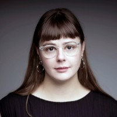
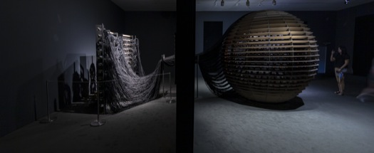

# La conférence de Rafael Lozano-Hemmer 

## Qui est Jade Séguéla ?
****

###### *Source de l'image: https://ca.linkedin.com/in/jade-s%C3%A9gu%C3%A9la-23185213b*

#### Jade Séguéla, passionnée par les musées et les arts numériques, détient une maîtrise en muséologie (2019) et un baccalauréat en arts numériques (2017) de l’Université Concordia. Elle a collaboré avec plusieurs institutions, dont le Musée d’art contemporain de Montréal et Eastern Bloc, ainsi qu'avec des organismes comme Tohu, Château Dufresne, et l’Institut du Patrimoine de l’UQAM. Actuellement, elle travaille pour l'artiste Rafael Lozano-Hemmer et elle était celle qui présentait la conférence de Rafael Lozano-Hemmer le 25 mars au Collège Montmorency.

****

## Qui est Rafael Lazano-Hemmer ?
****

###### *Source de l'image: https://www.lozano-hemmer.com/bio.php*

#### Rafael Lozano-Hemmer est né à Mexico en 1967. Il a obtenu un B.Sc. en chimie physique de l’Université Concordia à Montréal en 1989. Artiste médiatique, il travaille à l'intersection de l'architecture et de l'art de la performance. Il crée des installations interactives utilisant des technologies comme des lumières robotiques, des fontaines numériques et des réseaux télématiques, inspiré par la phantasmagorie, le carnaval et les animatroniques.

****

## La conférence
****

###### *Source de l'image: https://www.lozano-hemmer.com/sphere_packing_bach.php*

#### Lors de la conférence, Mademoiselle Séguéla a présenté sa biographie ainsi que celle de l'artiste Rafael Lozano-Hemmer. Elle a expliqué le processus créatif derrière ses œuvres, en mettant en avant les idées originales et audacieuses de l'artiste. Elle a aussi parlé des valeurs qui guident son travail, comme la participation des employés, l'interactivité et la rencontre entre technologie et art. Cette présentation nous a permis de mieux comprendre l’approche unique de Lozano-Hemmer, qui mêle art, science et technologies pour créer des expériences immersives.

#### De plus, Jade nous a expliqué le processus complexe et collaboratif derrière la création et l’exposition d’œuvres interactives. Elle a également présenté quatre œuvres importantes : Cloud Display, où un mot prononcé apparaît sous forme de fumée ; Binocular Tension, une installation où des yeux suivent les mouvements des utilisateurs ; Shadow Hunter, un globe terrestre qui reflète les ombres des passants et diffuse la radio d’un pays en fonction de l’emplacement de l'ombre ; et enfin Sphere Packing: Bach, une sphère en bois qui joue des milliers de compositions lorsque l’utilisateur entre à l’intérieur.

****

## Mon opinion 
****

#### La conférence à laquelle j'ai assisté a été très intéressante, offrant un aperçu du processus créatif des œuvres interactives et des valeurs des artistes comme Rafael Lozano-Hemmer. Jade Séguéla a bien expliqué l'importance de l'interaction avec le public et l'utilisation de nouvelles technologies pour créer des expériences immersives.

Parmi les œuvres présentées, Sphere Packing: Bach m'a beaucoup marqué. La sphère en bois, qui joue des milliers de compositions quand on entre à l'intérieur, crée une expérience unique. L'œuvre mélange de la musique structurée avec des sons aléatoires, ce qui crée un contraste fascinant entre ordre et chaos. Ce côté chaotique, mais contrôlé, m'a vraiment captivé.

